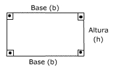

# Lista de Exercícios Complementares

1️⃣ Faça um programa em JavaScript- para ler a idade de uma pessoa expressa em anos, meses e dias e imprime essa idade apenas em dias. Dessa forma, será necessário realizar a leitura de 3 valores inteiros. Obs: Para efetuar o cálculo considere que 1 ano tem 365 dias, e 1 mês tem 30 dias.

2️⃣ A imobiliária IMOV vende apenas terrenos retangulares. Faça um programa para ler as dimensões de um terreno e depois exibir a área do mesmo. Para calcular a área de um retângulo use a fórmula: área = b * h

️3️⃣ Considere a descrição a seguir: 
“O custo de um carro novo para o consumidor é a soma do custo de fábrica com a percentagem do distribuidor (em cima do custo de fábrica) e dos impostos (também aplicados ao custo de fábrica)”. Supondo que a percentagem do distribuidor seja de 32% e os impostos de 41%, escrever um programa em JavaScript para ler o custo de fábrica de um carro e imprimir o custo ao consumidor.

️4️⃣ Considere a descrição a seguir: 
Para a escala Celsius a água é o elemento mais importante para a vida na terra. A escala Celsius possui o ponto zero na temperatura que a água congela e 100 na temperatura que a água ferve. As medidas então são feitas em graus Celsius (°C). A escala Fahrenheit, criada por Daniel Gabriel Fahrenheit, é uma escala de temperatura termodinâmica, onde o ponto de congelamento da água é de 32 graus Fahrenheit (°F) e o ponto de ebulição de 212 °F (com uma pressão atmosférica normal). Isso coloca os pontos de ebulição e de congelamento da água exatamente a 180 graus de separação. Faça um programa em linguagem C para ler um valor em graus Celsius. Em seguida converta esse valor para graus Fahrenheit. 

**Use a fórmula a seguir:**
Fahrenheit = 1.8 * Celsius + 32
